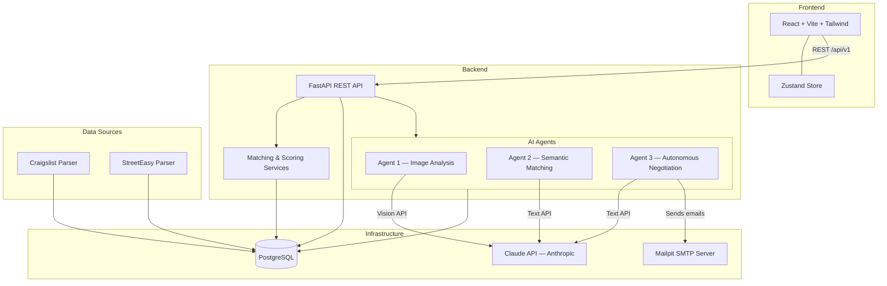

# 🏠 Rento

**Agent-powered apartment hunting and negotiation for NYC renters.**

Rento scrapes listings from Craigslist and StreetEasy, analyzes them with Claude AI (vision + text), matches them to your preferences, and autonomously negotiates with landlords via email — all from a single dashboard.

Built for **[EmpireHacks 2026](https://cornell-tech-hackathon.vercel.app/)**.

---

## ⚡ Quick Start

### Prerequisites

- [Docker](https://docs.docker.com/get-docker/) & Docker Compose
- An [Anthropic API key](https://console.anthropic.com/)

### Setup

```bash
# 1. Clone the repo
git clone https://github.com/cornell-projects-alexgravx/rento.git
cd rento

# 2. Configure environment
cp .env.example .env
# Edit .env
# -> set ANTHROPIC_API_KEY
# -> set POSTGRES_PASSWORD
# -> set SMTP_USERNAME
# -> set SMTP_PASSWORD
# -> set JWT_SECRET

# 3. Start everything
docker compose up -d

# 4. Open the app (locally)
open http://localhost:5173
```

| Service   | URL                     |
|-----------|-------------------------|
| Frontend  | http://localhost:5173    |
| API       | http://localhost:8000    |
| API Docs  | http://localhost:8000/docs |
| Mailpit   | http://localhost:8025    |

---

## 🏗️ Architecture



### Agent Pipeline

All three agents are implemented as **LangGraph** state machines, each with its own injected `AsyncSession`.

#### Agent 1 — Image Analysis (`backend/app/agents/agent1_image.py`)

Analyzes apartment photos with Claude Vision and stores style labels back on each `Apartment` row.

**LangGraph flow:**
```
START → fetch_apartment → call_claude_vision → persist_results → END
```

- Downloads up to 5 images, Base64-encodes them, and sends them to Claude Vision
- Claude returns `{ "labels": [...], "description": "..." }` — e.g. `"bright"`, `"minimalist"`, `"hardwood-floors"`
- Labels are written to `apartment.image_labels`; result is recorded as an `Agent1Log`
- **Triggered** automatically every 2 hours via APScheduler (batch over all unlabeled apartments), or on-demand per apartment via the API

#### Agent 2 — Semantic Match Ranking (`backend/app/agents/agent2_recommend.py`)

Re-ranks a user's existing `Match` rows using Claude, cross-referencing apartment style/neighborhood data with the user's preferences.

**LangGraph flow:**
```
START → fetch_user_context → fetch_matches → call_claude_batch → persist_rankings → END
```

- Loads the user's `SubjectivePreferences` (style labels, priority focus) and `ObjectivePreferences` (budget, bedroom type)
- Sends up to 20 match records to Claude in a single batch prompt
- Claude returns `[{ "apartment_id": "...", "score": 0–10, "reasoning": "..." }]`
- Scores are normalized to 0–1 and written back to `match.match_score` / `match.match_reasoning`

#### Agent 3 — Autonomous Negotiation (`backend/app/agents/agent3_outreach.py`)

Handles landlord outreach end-to-end — from the opening email through multi-round negotiation to a confirmed calendar invite.

**LangGraph flow (with loop):**
```
START → fetch_context → draft_email → send_email_node → poll_for_reply → analyze_reply
                              ↑___________________________________|
                           (counter_offer, rounds remaining)
        accepted  → generate_ics_node → finalize_success → END
        rejected / no_reply → finalize_no_deal → END
```

- Claude drafts the opening inquiry (with 3 proposed visit slots) or a counter-offer, using the user's `NegotiationPreferences` (style, goals, max rent, negotiable items)
- Emails are sent via SMTP; the agent polls the `messages` table for a `type="host"` row
- Claude classifies each reply as `"accepted"` / `"counter_offer"` / `"rejected"`
- On acceptance: generates an `.ics` calendar file and emails it to the host; marks `match.status = "completed"`
- On failure: resets `match.status = "not_started"` and sends the user a `Notification`

---

### Matching Service (`backend/app/services/matching.py`)

Pure algorithmic layer — no Claude calls.

1. **Objective filter** — hard-criteria pass/fail per apartment (bedroom type, price range, area, pets, laundry, parking, move-in date, lease length); passes become `Match` rows (idempotent upsert)
2. **Swipe feedback** — `like` / `dislike` / `love` on a listing updates `SubjectivePreferences.image_labels` via set union/difference, then rescores all matches
3. **Scoring formula:**

   ```
   score = w1 × label_jaccard + w2 × price_score + w3 × commute_score
   ```

   Weights are determined by `priority_focus`:

   | Focus | label | price | commute |
   |-------|-------|-------|---------|
   | `features` | 0.6 | 0.2 | 0.2 |
   | `price` | 0.2 | 0.6 | 0.2 |
   | `location` | 0.2 | 0.2 | 0.6 |

---

### Data Ingestion Pipeline (`backend/parsers/`)

Pulls listings from StreetEasy and Craigslist alert emails into the database.

```
Gmail API → email parser → ZenRows scraper → DB upsert
```

| File | Role |
|------|------|
| `gmail_fetcher.py` | Fetches unread alert emails from Gmail API |
| `streeteasy_email.py` / `craigslist_email.py` | Parses email HTML to extract listing URLs |
| `streeteasy_scraper.py` / `craigslist_scraper.py` | Scrapes full listing details via ZenRows (anti-bot proxy); Claude optionally fills missing fields |
| `streeteasy_db_writer.py` / `craigslist_db_writer.py` | Upserts enriched listings into `apartments` table |
| `pipeline.py` | Unified CLI entry point (`--source streeteasy|craigslist|both`, `--no-scrape`, `--eml`) |

---

### Tech Stack

| Layer | Technology |
|-------|------------|
| Frontend | React 18, TypeScript, Vite, Tailwind CSS, Zustand |
| Backend | Python 3.12, FastAPI, SQLAlchemy (async) |
| AI | Claude 3.5 Sonnet, LangGraph |
| Database | PostgreSQL 16 (asyncpg) |
| Email | Mailpit (dev), SMTP |
| Scheduling | APScheduler (AsyncIOScheduler) |
| Infra | Docker Compose |

### Project Structure

```
rento/
├── frontend/
│   └── src/
│       ├── pages/           # Onboarding, Dashboard (Match, AgentLog)
│       ├── store/           # Zustand global state
│       ├── lib/             # api.ts (typed API client), apiAdapter.ts
│       └── components/      # Navbar, Sidebar, PreferencesModal, UI primitives
├── backend/
│   ├── app/
│   │   ├── main.py          # FastAPI app, CORS, rate limiting, APScheduler setup
│   │   ├── database.py      # Async SQLAlchemy engine & session factory
│   │   ├── constants.py     # Env-driven config (CORS origins, agent tuning)
│   │   ├── agents/
│   │   │   ├── agent1_image.py      # LangGraph: image analysis
│   │   │   ├── agent2_recommend.py  # LangGraph: semantic ranking
│   │   │   ├── agent3_outreach.py   # LangGraph: negotiation loop
│   │   │   └── shared/              # claude_client, smtp_client, ics_generator
│   │   ├── routers/         # FastAPI route handlers (legacy + /api/v1 bridge)
│   │   ├── models/          # SQLAlchemy ORM: User, Apartment, Match, Message, Notification, Preferences, AgentLogs
│   │   ├── services/        # matching.py (filter, swipe, scoring), commute.py
│   │   └── schemas/         # Pydantic I/O schemas
│   └── parsers/             # Gmail fetcher, StreetEasy/Craigslist scrapers & DB writers, pipeline CLI
└── docker-compose.yml
```

---

## 👥 Contributors

| Contributor | GitHub |
|-------------|--------|
| Ruolan Chen | [@OrchidRLan](https://github.com/OrchidRLan) |
| Kerui Bai | [@KrisssWW](https://github.com/KrisssWW) |
| Max Lytovka | [@Reymer249](https://github.com/Reymer249) |
| Alexandre Gravereaux | [@alexgravx](https://github.com/alexgravx) |

---

## 📄 License

This project is licensed under the [MIT License](./LICENSE).
